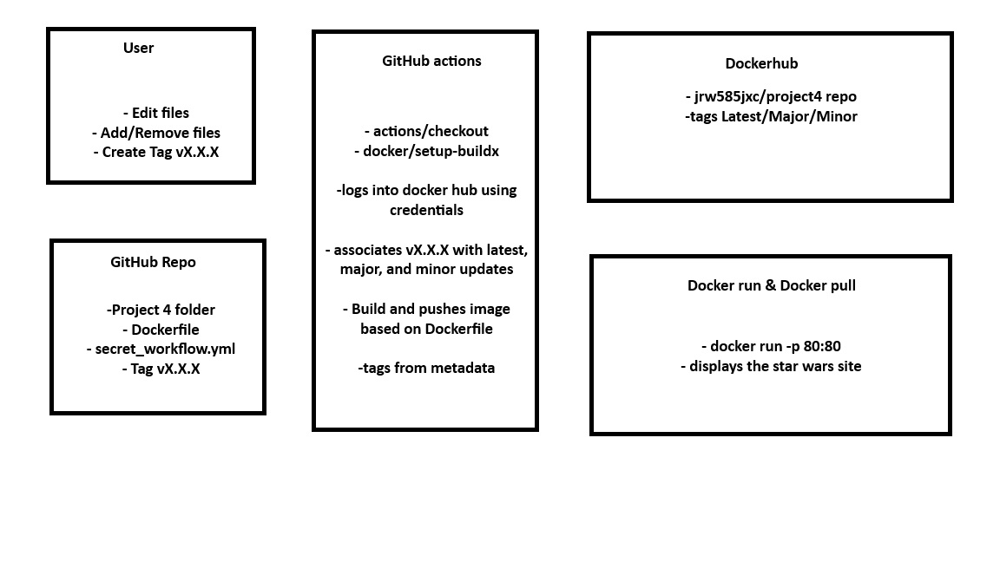

# README-Cl.md
**Part 1: Create a Docker Image**

1. In the [Project4](.) folder, added [web-content](web-content) from Project 3 with the following:
    - index.html
    - about.html
    - style.css

I used generative AI to create a site with a star wars theme.

- I used Perplexity
- I fed it the following prompt:


Created a [Dockerfile](Dockerfile) with the following three instructions:

- FROM httpd:2.4
- COPY web-content/ /usr/local/apache2/htdocs/
- EXPOSE 80

Built and tagged a container image using my [Dockerfile](Dockerfile) as the build instructions


Tested that the docker file pulled the files successfully

*Note: I added an alias for quicker login as specified in Project 3*


**Part 2: Create Docker Hub access token (PAT)/Add GitHub repository secrets**

Created Docker Hub access token (PAT)

*Account Settings → Security → New Access Token.*

Name: github-actions -project4

Read and write as scope

1. Logged into DockerHub on the command line using Personal Access Token (PAT) instead of a password. (I created an alias called dockerlogin to do so quickly)
2. Pushed container image to a **public** DockerHub repository in my account.
    


Added GitHub repository secrets

1. Settings → Secrets and variables → Actions.
2. New repository secret and create:
3. dockeruser → value = username
4. dockertoken → value = token


Built Workflow
[secret_workflow.yml](../.github/workflows/secret_workflow.yml)

*Note: if used in another repository, location of Dockerfile needs to be updated in .yml to work with github actions*

1. Logs in using github secrets

2. You can test it by going to actions, and seeing if any errors or present. When clicking on the workflow, it shows all parts functioned. 

Tested and working


**Part 3: Semantic Versioning**

Added versioning to [secret_workflow.yml](cicdf25-jrw585jxc/.github/workflows/secret_workflow.yml)

1. To see tags in a git repository: git tag -n
2. To generate a tag in a git repository: git tag -a vX.X.X -m "Version X.X.X"
3. To push a tag in a git repository to GitHub: git push origin vX.X.X


1. The workflow triggers on push
2. Then names the docker image according to the tags on latest push

*Note: if used in another repository, location of Dockerfile needs to be updated in .yml to work with github actions*

3. You can test it by going to actions, and seeing if any errors or present. When clicking on the workflow, it shows all parts functioned.

```
on:
push:
tags:
     - 'v*.*.*'

tags: |
type=semver,pattern=latest
type=semver,pattern={{major}}
type=semver,pattern={{major}}.{{minor}}
```

github command to tag and push tag


You can check for success by going to the related docker hub and see the updated versions

Docker correctly pulling major minor and latest


https://hub.docker.com/repository/docker/jrw585jxc/project4/general


**Part 4: Diagram**




**Citations / resources used**

No additional resources were used outside of perplexity in project3 for generation of the html/css. Used various resources linked in the github for the project, mostly those listed below.

https://github.com/docker/metadata-action?tab=readme-ov-file#semver - helped me create and debug "secret-workflow.yml
https://semver.org/ - Helped ensure I was naming properly and using good version control
https://github.com/marketplace/actions/build-and-push-docker-images - also helped me create and debug "secret-workflow.yml