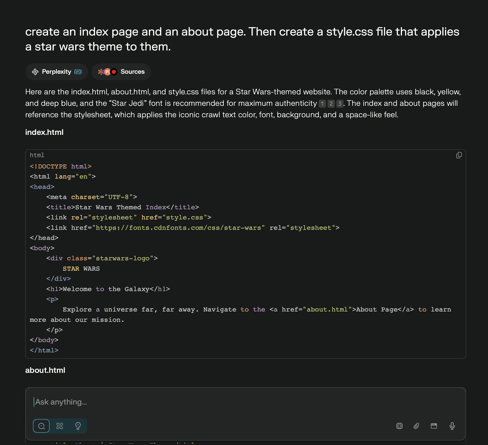
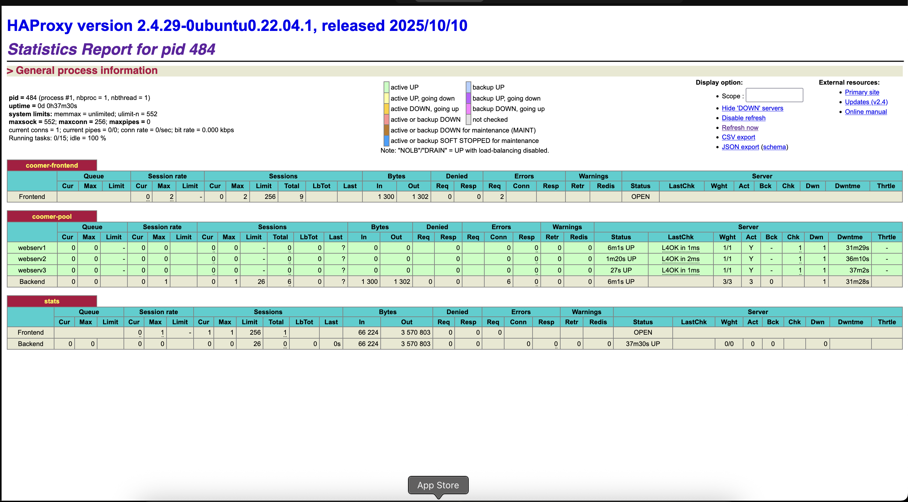

# README.md
**Part 1 - Create a Docker Image**

1. In the `Project4` folder, added `web-content` from Project 3 with the following:
    - index.html
    - about.html
    - style.css

I used generative AI to create a site with a star wars theme.

- I used Perplexity
- I fed it the following prompt:

Created a `Dockerfile` with the following three instructions:

- FROM httpd:2.4
- COPY web-content/ /usr/local/apache2/htdocs/
- EXPOSE 80

Built and tagged a container image using my `Dockerfile` as the build instructions

Tested that the docker file pulled the files successfully

**Create Docker Hub access token (PAT)/Add GitHub repository secrets**

Created Docker Hub access token (PAT)

*Account Settings → Security → New Access Token.*

Name: github-actions -project4

1. Logged into DockerHub on the command line using Personal Access Token (PAT) instead of a password. (I created an alias called dockerlogin to do so quickly)
2. Pushed container image to a **public** DockerHub repository in my account.
    
    

Added GitHub repository secrets

1. Settings → Secrets and variables → Actions.
2. New repository secret and create:
3. dockeruser → value = username
4. dockertoken → value = token

Built Workflow

[workflow.yml](.github/workflows/workflow.yml)

1. Logs in using github secrets

Tested it works

Copied [`lb-cf-template.yml`](https://github.com/pattonsgirl/CEG3120/blob/main/Projects/Project3/lb-cf-template.yml) to my `Project3` folder.  Named it `Coomer-lb-cf.yml`

Made the modifications as specified in project description below:

1. Use AMI of your choice that is Ubuntu 18+ or Amazon Linux 2+
2. VPC CIDR block: `192.168.0.0/23`
3. Public subnet range: `192.168.0.0 - 192.168.0.255`
4. Private subnet range: `192.168.1.0 - 192.168.1.255`
5. Modifications for Security Group:
    - Allow `ssh` requests within VPC CIDR block
    - Allow `ssh` requests from your home IP
    - Allow `ssh` requests from Wright State IP block (`130.108.0.0/16`)
    - Allow `http` requests from within VPC CIDR block
    - Allow `http` requests from any IP
    - *If doing Extra Credit* add `https` rules **in addition to** `http` rules
- assign private IP on the public subnet
- use instance `UserData` to configure a unique `hostname` on the instance
- use instance `UserData` to install `haproxy`
    - depending on AMI, also perform steps to start & enable service

Create three host instances (one is templated, two more need to be added)

- tag each with a unique Name Value
- assign each a private IP on the private subnet
- use instance `UserData` to configure a unique `hostname` on the instance
- install docker
- pull and run your DockerHub image in detached mode bound to host
port 80 and container port 80. Use the appropriate flag to have the
container restart automatically if the system is rebooted / if the
docker service has an outage.

**Part 3 - Setup Proxy Server**

Configured proxy server per the requirements specified in project description.

Used the following resources, was very helpful.

[https://www.haproxy.com/blog/haproxy-ssl-termination](https://www.haproxy.com/blog/haproxy-ssl-termination)

[https://www.tecmint.com/configure-ssl-certificate-haproxy/](https://www.tecmint.com/configure-ssl-certificate-haproxy/)

**README**

1. Project description
    - The goal of the project is to build a container image from Apache's httpd with web content and publish it to DockerHub. Then, modify the project CF template to meet requirements for this project to then run the website container on hosts in the pool. Then configure `haproxy` as a load balancer / application delivery controller to direct traffic to the pool
    - Once the CF template is configured, you go to **AWS → Cloudformation → Create Stack → With new resources → and then select your template**. Then It begins creating the stack with your desired configurations
    - The template builds a variety of resources
        - **VPC:** A custom VPC with CIDR block 192.168.0.0/23 with public and private subnets
        - **Internet Gateway:** Allowing public internet access into the VPC resources within the public subnet.
        - **Public Subnet**: Subnet (192.168.0.0/24) configured to assign the public IPs to instances for access externally.
        - **Private Subnet:** Subnet (192.168.1.0/24) with no direct public IPs for backend resources.
        - **NAT Gateway:** In the public subnet with an Elastic IP to enable private subnet instances to access the internet securely for updates etc.
        - **Route Tables:** Public route table directs internet-bound traffic to the Internet Gateway; Private route table routes through NAT Gateway.
        - **Security Group:** Defines firewall rules allowing SSH, HTTP, and HTTPS from specified IP ranges including internal VPC CIDR and external trusted IPs.
        - **EC2 Instances:**
            - **Proxy Instance:** Located in the public subnet, runs HAProxy as the reverse proxy/load balancer.
            - **WebServ1, WebServ2, WebServ3:** Three backend servers in the private subnet, each runing Docker with the “project3" container web services on port 80.
2. **Building a web service container:**
    - The [web-content](./web-content/) has a home(index) page, and about page, and a style.css included.
    - The [dockerfile](./dockerfile) sets the container to be an Apache HTTP Server image, and pulls the web-contents folder into the proper place in the container
    - Security -> Personal Access Tokens -> Create New Access Token
    - Token scope: Read & Write
    - [Docker image on docker hub](https://hub.docker.com/repository/docker/jrw585jxc/project3/general)
3. **Connections to instances within the VPC:**
    - The purpose of configuring hosts/.ssh is to more easily connect without each time entering the key and other parameters.
    - In this case, I set up a config for the main proxy instance, and then ssh’d into the webservers from that instance manually.
4. **Setting up the HAProxy load balancing instance:**
    - Located /etc/haproxy/haproxy.cfg
    - Allows me to configure settings, in this case it allowed me to setup the frontend and backend.
    - [haproxy.cfg](./haproxy.cfg)
    - You can run sudo haproxy -c -f /etc/haproxy/haproxy.cfg to check the status without restarting
    - sudo systemctl <keywork> haproxy
        - start, stop, restart reload
5. **Prove the load balancer is working:**
    - I initially ran into the issue that all 3 showed red and non functioning. I realized after a long time that my docker image hadn’t initially been created with support for linux architecture having created it on a mac.
    - I fixed this by running: 
    **“docker buildx build --platform linux/amd64,linux/arm64 -t jrw585jxc/project3:coomer --push .”**
    - I ran the following command on all 3 web servers:
    **sudo docker run -d --name project3 --restart unless-stopped -p 80:80 jrw585jxc/project3:coomer**
        
        
        
    
6. **Citations / resources used**

[https://www.haproxy.com/blog/haproxy-ssl-termination](https://www.haproxy.com/blog/haproxy-ssl-termination)

[https://www.tecmint.com/configure-ssl-certificate-haproxy/](https://www.tecmint.com/configure-ssl-certificate-haproxy/)

[https://docs.docker.com/build/building/multi-platform/](https://docs.docker.com/build/building/multi-platform/)