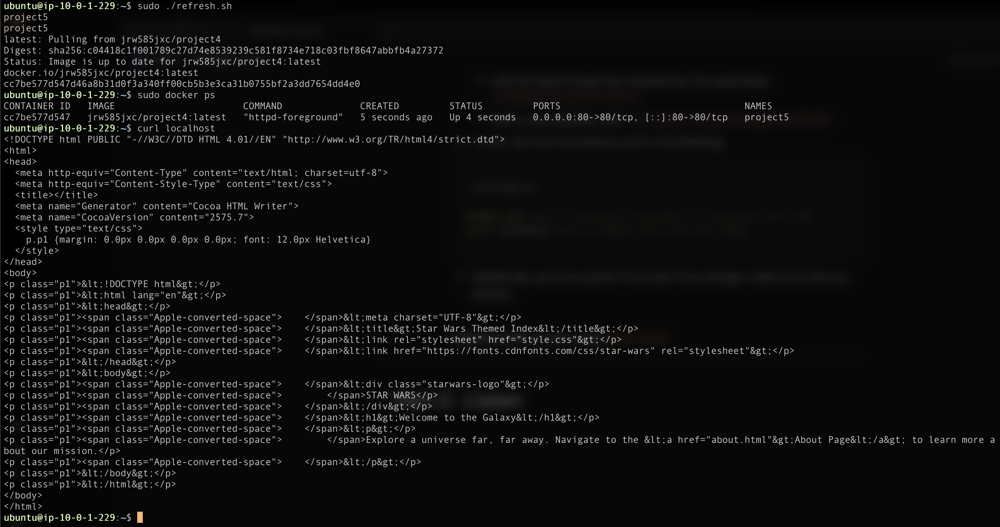
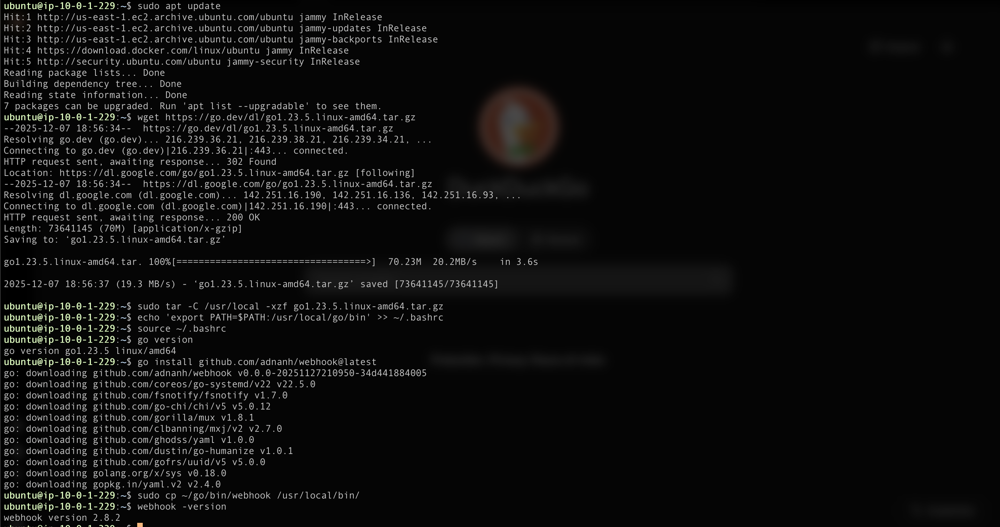
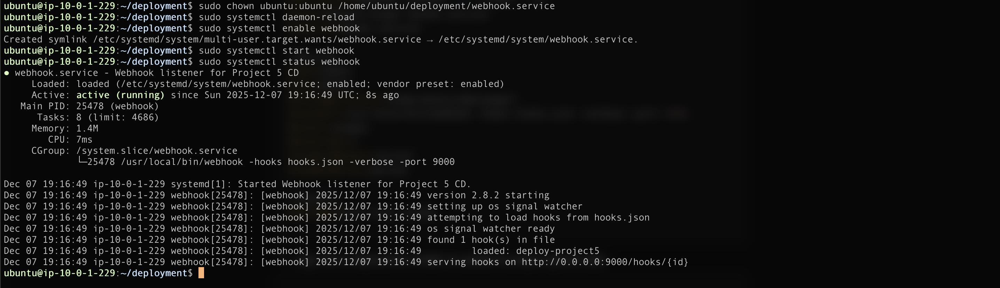
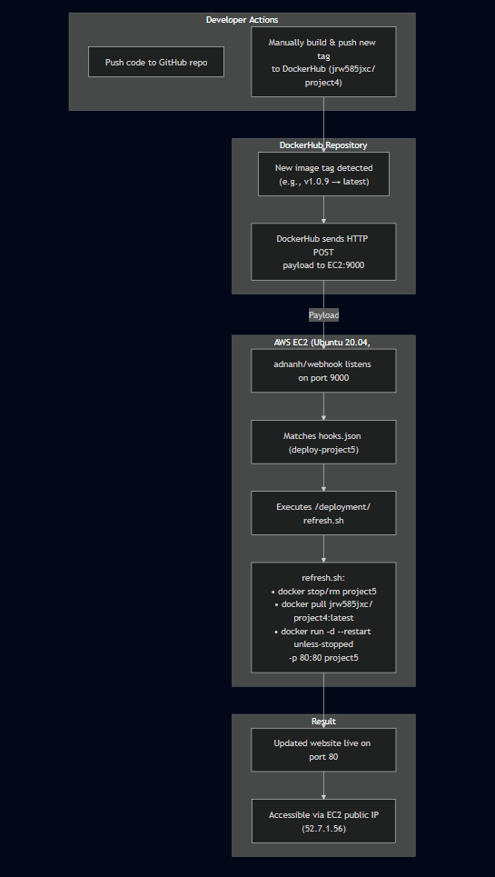

# README-CD.md

# Part 1: **Script a Refresh**

## Instance and Docker

---

I used a YAML script, **[projec5-cf.yml](projec5-cf.yml)**, to do the following:

1. Create an EC2 instance.
2. Install Docker on that instance.
3. Test that the instance can run a container from a DockerHub repo image.

Additionally in the script, and also uploaded to the deployment folder, is a bash script, **[refresh.sh](deployment/refresh.sh)**, that does the following:

1. Stops and removes the previous running container.
2. pulls the latest image from DockerHub repo based on tag **`latest`**
3. Runs a new container using the pulled latest image.
    - NOTE: Runs detached with flags to resume when docker has started, which occurs on system start.

## Documentation

---

1. **EC2 Instance Details**
    - Ubuntu 20.04 LTS (ami-053b0d53c279acc90)
    - t2.medium - 2 CPU Core, 4gb RAM
    - 30gb of storage
2. **Security Group configuration:**
    
    
    | Port | Protocol | IP | Justification/Explanation |
    | --- | --- | --- | --- |
    | 22 | TCP | 69.61.173.83/32 (home IP) | SSH access from home |
    | 22 | TCP | 130.108.0.0/16 (WSU) | SSH access from school |
    | 80 | TCP | 0.0.0.0/0 | HTTP access |
    | 9000 | TCP | 0.0.0.0/0 | webhook |
3. **Docker Setup on OS on the EC2 instance**
    1. **Dependencies based on OS**
        - Only basic ubuntu packages needed, ca-certificates, curl, & gnupg.
        - NOTE: These are necessary as the base repositories don’t include docker, results in `The repository 'http://archive.ubuntu.com/ubuntu focal Release' does not have a Release file.`
        
        ---
        
    2. **How to install Docker**
        
        1. Update:
        
        ```bash
        sudo apt-get update
        ```
        
        2. Install dependency packages:
        
        ```bash
        sudo apt-get install ca-certificates curl
        ```
        
        3. Add Docker's GPG key:
        
        ```bash
        sudo install -m 0755 -d /etc/apt/keyrings
        curl -fsSL https://download.docker.com/linux/ubuntu/gpg | sudo gpg --dearmor -o /etc/apt/keyrings/docker.gpg
        sudo chmod a+r /etc/apt/keyrings/docker.gpg
        ```
        
        4. Set up repository:
        
        ```bash
        echo \
        "deb [arch=$(dpkg --print-architecture) signed-by=/etc/apt/keyrings/docker.gpg] https://download.docker.com/linux/ubuntu \
        $(. /etc/os-release && echo "$VERSION_CODENAME") stable" | \
        sudo tee /etc/apt/sources.list.d/docker.list > /dev/null
        ```
        
        5. Install Docker:
        
        ```bash
        sudo apt-get update
        sudo apt-get install docker-ce docker-ce-cli containerd.io docker-buildx-plugin docker-compose-plugin
        ```
        
         **Source**: [Docker Docs - Install Docker Engine on Ubuntu](https://docs.docker.com/engine/install/ubuntu/)
        
        ---
        
    3. **How to confirm Docker is installed and can successfully run containers**
        
        Attempts to start container using dockers official test image and then removes after testing. 
        
        ```bash
        docker run --rm hello-world
        ```
        
        ---
        
    4. **Testing on EC2 Instance**
        1. **How to Pull Container Image from DockerHub**
            
            ```bash
            docker pull ${DockerHubImage}
            ```
            
            - Uses your Project 4 image (e.g., `jrw585jxc/project4:latest`)
            - Confirms DockerHub connectivity and image download are working
            
            ---
            
        2. **How to Run Container from Image**
            
            ```bash
            docker run -d --name project5 --restart unless-stopped -p 80:80 ${DockerHubImage}
            ```
            
            - Runs detached
                - NOTE: Used -d over -it. -it is good for testing, but keeps the terminal occupied. Once you are past testing, it is better to have it be a detached process that runs in the background.
            - Resumes on Docker/system starting
            - Port mapped to 80:80 for web access
    
    ---
    
    1. **Scripting Container Application Refresh**
        1. Description of the bash script
            - Stops the existing container and removes it
            - pulls the latest image from DockerHub, this case being `jrw585jxc/project4:latest`
            - start a new container with `d --restart unless-stopped -p 80:80`
        2. To test, ssh into the instance and try the following: 
        
        ```bash
        ./refresh.sh
        
        docker ps# see if "project5" container is running on port 80
        curl localhost# see if update html from new image
        ```
        
        
        
        - Additionally, go to the public IP and see if the changes made to the site are present.
        
        **Additional link to bash script: [refresh.sh](deployment/refresh.sh)**
        

# Part 2:  **Listen**

1. **Install [adnanh's `webhook`](https://github.com/adnanh/webhook) to the EC2 instance**
    
    ```bash
    sudo apt update
    wget https://go.dev/dl/go1.23.5.linux-amd64.tar.gz
    sudo tar -C /usr/local -xzf go1.23.5.linux-amd64.tar.gz
    echo 'export PATH=$PATH:/usr/local/go/bin' >> ~/.bashrc
    source ~/.bashrc
    
    go version# verify installed
    
    go install github.com/adnanh/webhook@latest
    sudo cp ~/go/bin/webhook /usr/local/bin/
    webhook -version# verify installed
    ```
    
    
    
    ---
    
2. **Create Hook Definition**
    
    ```bash
    cd /home/ubuntu/deployment
    sudo nano hooks.json
    ```
    
    ```json
    {
      "id": "deploy-project5",
      "execute-command": "/home/ubuntu/deployment/refresh.sh",
      "command-working-directory": "/home/ubuntu/deployment",
    }
    ```
    
    - Runs bash script when payload is received
    - Validates that payload is from dockerhub rep
    
    <aside>
    ⚠️
    
    **IMPORTANT**
    
    I could not get **[hooks.json](deployment/hooks.json)** trigger rules to work, and had to unfortunately remove them and allow all payloads to trigger. 
    
    I continuesly got error:
    
    ```bash
    deploy-project5 got matched, but didnt get triggered because the trigger rules were not satisfied
    ```
    
    **Things I tried:**
    
    - Tried debug script to get specific payload terms
    
    ```bash
    [
     {
    	"id": "debug-payload",
    	"execute-command": "/home/ubuntu/deployment/debug.sh",
    	"pass-arguments-to-command": [
    	{ "source": "entire-payload" }
    	]
     }
    ]
    ```
    
    - Ended up with the payload to look at.
    
    ```bash
    Dec 08 02:36:14 ip-10-0-1-229 webhook[1727]: [webhook] 2025/12/08 02:36:14 [a9f736] executing /home/ubuntu/deployment/debug.sh (/home/ubuntu/deployment/debug.sh) with arguments ["/home/ubuntu/deployment/debug.sh" "{\"callback_url\":\"https://registry.hub.docker.com/u/jrw585jxc/project4/hook/e874379b3d644fedbef44c64a0650d3d/\\",\\"push_data\\":{\\"images\\":[],\\"media_type\\":\\"application/vnd.oci.image.config.v1+json\\",\\"pushed_at\\":1765161373,\\"pusher\\":\\"jrw585jxc\\",\\"tag\\":\\"v1.0.9\\"},\\"repository\\":{\\"date_created\\":1764536988,\\"description\\":\\"\\",\\"full_description\\":null,\\"is_official\\":false,\\"is_private\\":false,\\"is_trusted\\":false,\\"name\\":\\"project4\\",\\"namespace\\":\\"jrw585jxc\\",\\"owner\\":\\"jrw585jxc\\",\\"repo_name\\":\\"jrw585jxc/project4\\",\\"repo_url\\":\\"https://hub.docker.com/r/jrw585jxc/project4\\",\\"star_count\\":0,\\"status\\":\\"Active\\"}}"] and environment [] using as cwd Dec 08 02:36:14 ip-10-0-1-229 webhook[1727]: [webhook] 2025/12/08 02:36:14 [a9f736] command output: /home/ubuntu/deployment/debug.sh: line 2: /home/ubuntu/deployment/payload.json: Permission denied
    ```
    
    - Tried the following
    
    ```bash
    [
      {
        "id": "deploy-project5",
        "execute-command": "/home/ubuntu/deployment/refresh.sh",
        "command-working-directory": "/home/ubuntu/deployment",
        "trigger-rule": {
          "match-all": [
            {
              "type": "payload",
              "query": "repository.namespace",
              "pattern": "jrw585jxc"
            },
            {
              "type": "payload",
              "query": "repository.name",
              "pattern": "project4"
            },
            {
              "type": "payload",
              "query": "push_data.tag",
              "pattern": ".*"
            }
          ]
        }
      }
    ]
    ```
    
    ```bash
    [
      {
        "id": "deploy-project5",
        "execute-command": "/home/ubuntu/deployment/refresh.sh",
        "command-working-directory": "/home/ubuntu/deployment",
        "trigger-rule": {
          "match-all": [
            {
              "type": "payload",
              "query": "repository.namespace",
              "pattern": "jrw585jxc"
            },
            {
              "type": "payload",
              "query": "repository.name",
              "pattern": "project4"
            },
            {
              "type": "payload",
              "query": "push_data.tag",
              "pattern": "latest"
            }
          ]
        }
      }
    ]
    ```
    
    ```bash
    [
      {
        "id": "deploy-project5",
        "execute-command": "/home/ubuntu/deployment/refresh.sh",
        "command-working-directory": "/home/ubuntu/deployment",
        "trigger-rule": {
          "match-all": [
            {
              "type": "payload",
              "query": "repository.repo_name",
              "pattern": "jrw585jxc/project4"
            },
            {
              "type": "payload",
              "query": "tag",
              "pattern": "latest"
            }
          ]
        }
      }
    ]
    ```
    
    ```bash
    "match-all": [
      { "type": "payload", "query": "repository.name", "pattern": "project4" }
    ]
    
    ```
    
    Tried several other iterations that got lost along the way.
    
    Ultimately could not get past:
    
    ```bash
    deploy-project5 got matched, but didnt get triggered bvecause the trigger rules were not satisfied
    ```
    
    </aside>
    
    ---
    
3. **Set up a service file**

```bash
sudo nano /etc/systemd/system/webhook.service
```

```bash
[Unit]
Description=Webhook listener for Project 5 CD
After=network.target docker.service
Requires=docker.service

[Service]
Type=simple
User=ubuntu
WorkingDirectory=/home/ubuntu/deployment
ExecStart=/usr/local/bin/webhook -hooks hooks.json -verbose -port 9000# links to hooks json
Restart=always
RestartSec=5
StandardOutput=journal#allows looking at live logs in journalctl
StandardError=journal

[Install]
WantedBy=multi-user.target
```

- copy file to deployment folder to upload to project github later

```bash
cp /etc/systemd/system/webhook.service /home/ubuntu/deployment/
```

- Enable/start the service

```bash
sudo systemctl daemon-reload
sudo systemctl enable webhook
sudo systemctl start webhook
```

- Verify service is running

```bash
sudo systemctl status webhook
```



---

**To test that the trigger is working.**

```bash
curl -X POST http://localhost:9000/hooks/deploy-project5 \
  -H "Content-Type: application/json" \
  -d '{
    "repository": {
      "namespace": "jrw585jxc",
      "name": "project4",
      "repo_name": "jrw585jxc/project4"
    },
    "push_data": {
      "tag": "latest"
    }
  }'
```

**Verify script triggered**

```bash
sudo journalctl -u webhook -f# Shows if it triggered
docker ps#shows the refreshed project5 container
```

---

**LINK to definition file, [hooks.json](deployment/hooks.json)**

**LINK to service file. [webhook.service](deployment/webhook.service)**

---

# Part 3: Send a Payload

### Justification

> I chose to use DockerHub instead of Github to be the payload sender. Github actions were a pain to setup in previous projects in comparison to working with docker, and this would require additional yaml workflows to work. Additionally, I think that using Dockerhub is better practice, as this allows any GitHub repo to push to the docker repository if i set it up, and still trigger the payload push, where as if I pushed with GitHub, I would have to configure it for each repo.
> 

---

1. **How to enable dockerhub to send payloads to `webhook` listener**
    1. Go to: [https://hub.docker.com/r/jrw585jxc/project4](https://hub.docker.com/r/jrw585jxc/project4)
    2. Click**"Webhooks** tab
        1. Webhook name: `Project5-CD`
        2. Webhook URL:`http://52.7.1.56:9000/hooks/deploy-project5`
    3. Click the **+** button
2. **What triggers will send a payload**
    1. Only new tags will trigger the payload. For example:
        1. Previous tag: **`v1.0.1`**
        2. New tag: **`v1.0.2`**
        - This new tag will trigger given there’s no other tag named **`v1.0.2`**
3. **To verify a successful payload delivery:**
    1. You can verify by running the following monitor command:
        
        ```bash
        sudo journalctl -u webhook -f# Shows if it triggered
        ```
        
    2. You should see output **“Incoming HTTP POST request from (IP)”**
    
    ---
    
4. **Validate that your webhook *only triggers* when requests are coming from Docker repo**
    1. You can run the following commands to test.
    
    **This one should work**
    
    ```bash
    curl -X POST http://52.7.1.56:9000/hooks/deploy-project5 \
      -H "Content-Type: application/json" \
      -d '{
        "repository": {"namespace": "jrw585jxc", "name": "project4"},
        "push_data": {"tag": ".*"}
      }'
    ```
    
    ---
    
    **This one should NOT work**
    
    ```bash
    curl -X POST http://52.7.1.56:9000/hooks/deploy-project5 \
      -H "Content-Type: application/json" \
      -d '{
        "repository": {"namespace": "hacker", "name": "project4"},
        "push_data": {"tag": ".*"}
      }'
    ```
    
    - NOTE: The namespace being “hacker” should not recognize and trigger.
    
    ---
    

# Part 4- Project Description & Diagram

Documentation Requirements:

1. **Project Overview**
    
    The purpose of this project is to learn to automate the development/deployment of a website or webapp. By utilizing EC2, DockerHub, and webhooks, I am able to automate the entire process of development to deployment.
    
2. **What tools are used in this project/what are they used for**
    
    
    | **AWS EC2** | Host of the docker image, runs the container |
    | --- | --- |
    | **Docker** | Manages containerization of images on the EC2 instance |
    | **DockerHub** | Container image repo that stores built images and can send webhook notifications based on new image pushes |
    | **GitHub** | Source code repository that triggers Docker builds and image pushes |
    | **adnanh/webhook** | Listens for webhooks and triggers scripts based on a payload |
    | **Bash Script (refresh.sh)** | Automates pulling the new images and restarting the container. |
3. **Diagram of project**
    

    
4. **What is not working in this project**
    
    > The triggered rules of the **hooks.json** did not work and were not included in the final upload, verbose explanation of troubleshooting and why I believe the issue is happening shown above in part 2.
    > 

# Resources

- [Docker Docs](https://docs.docker.com/docker-hub/repos/manage/webhooks/) for payload structure/webhook setup
- [GitHub Webhook](https://github.com/adnanh/webhook) for webhook setup/trigger rules
- [Docker Docs - Ubuntu](https://docs.docker.com/engine/install/ubuntu/) for docker install
- [Using GitHub actions and `webhook`s](https://levelup.gitconnected.com/automated-deployment-using-docker-github-actions-and-webhooks-54018fc12e32) for trigger rules (still couldn’t get it working)
- [Using DockerHub and `webhook`s](https://blog.devgenius.io/build-your-first-ci-cd-pipeline-using-docker-github-actions-and-webhooks-while-creating-your-own-da783110e151) for trigger rules (still couldn’t get it working)